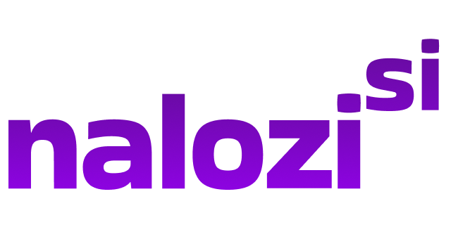
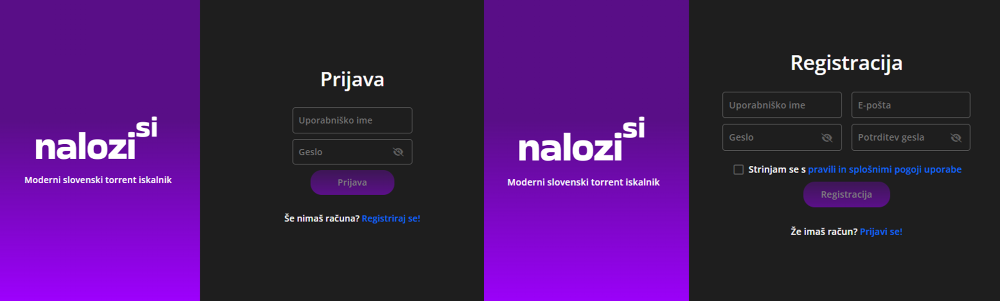
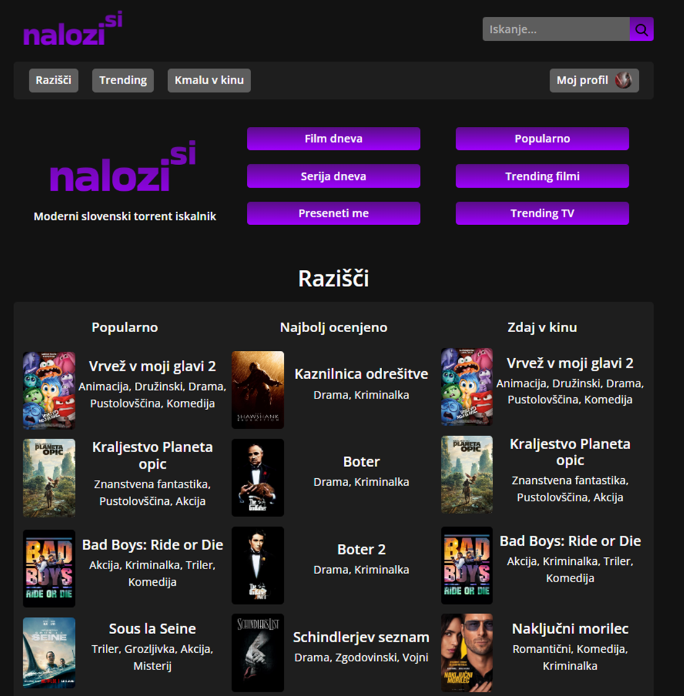
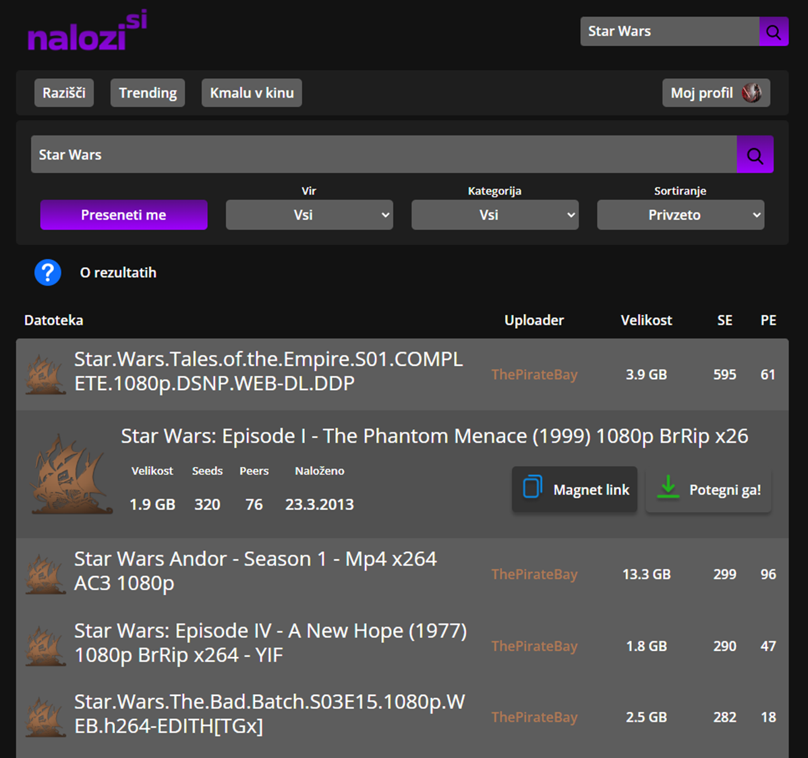
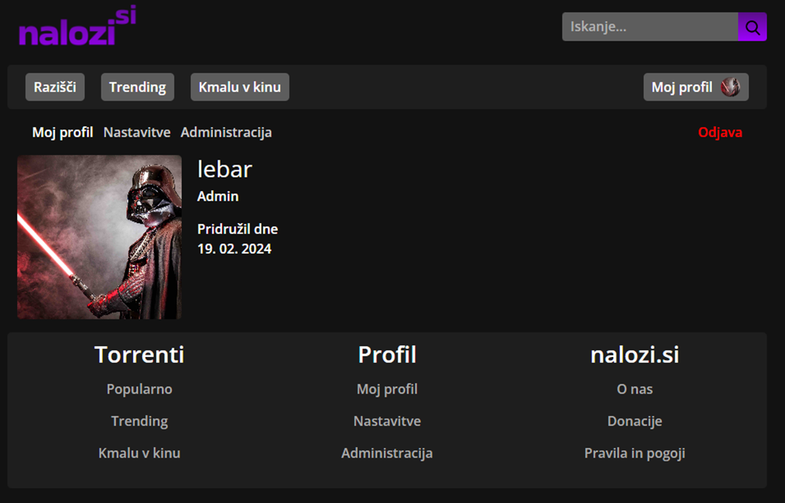
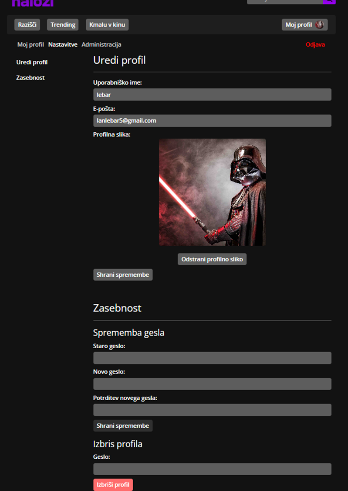
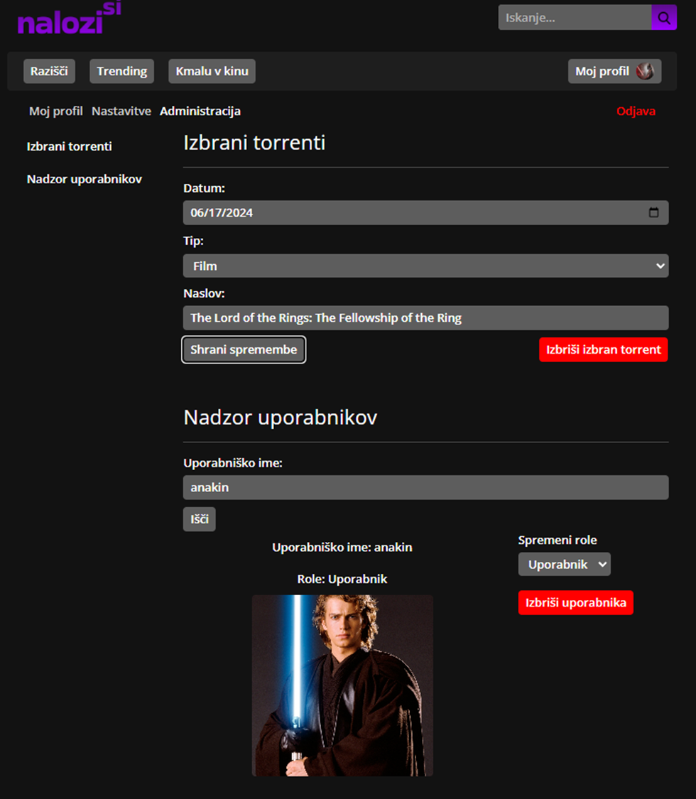

 

  
  <h3 align="center" style="margin-top:0;">potegni.me Angular frontend</h3>

## About The Project

Backed: [potegnime-api](https://github.com/lebaaar/potegnime-api)

Torrent search platform build with Angular on the frontend and ASP.NET on the backend. PostgreSQL database.
Features:
-  User registration and login system
    -  Hashing passwords with BCrypt
    - Authentication using JWT
    - System of regular and users and admins
- Torrent search using [torrent-search-api](https://www.npmjs.com/package/torrent-search-api)
    - Search torrents from ThePirateBay, YTS or TorrentProject
- Explore movies and series - data provided by [TMDB API](https://www.themoviedb.org/)
    - I'm feeling lucky functionality
    - Movie/series of the day (set by admins then visible to other users)

Project is not published. Formly known as nalozi.si.

## Frontend

Built with Angular framework using HTML, SCSS and TypeScript. Utilizing [Bootstrap](https://getbootstrap.com/). Designed in Figma.

Project images:

## License

Distributed under the MIT License. See [`LICENSE.txt`](LICENSE.txt) for more information.

## Contact

Lan Lebar - [LinkedIn](https://www.linkedin.com/in/lan-lebar) - lanlebar6@gmail.com

Project Link: [https://github.com/lebaaar/potegnime-angular](https://github.com/lebaaar/potegnime-angular)

(<a href="#readme-top">back to top</a>)
